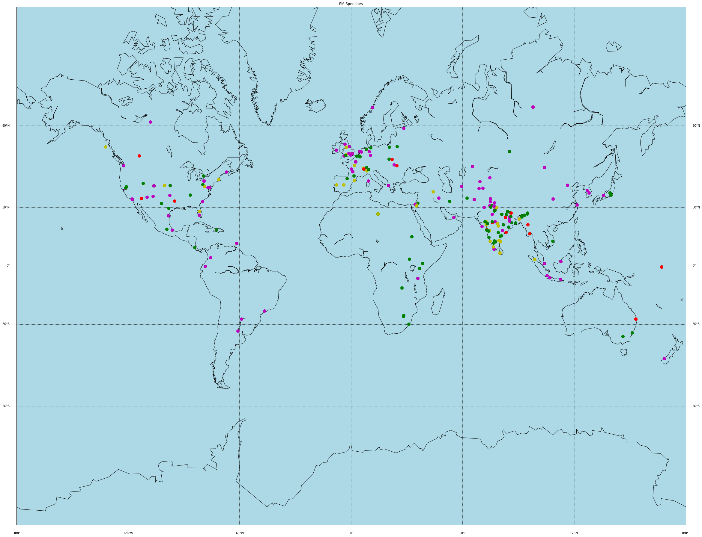

# PM Speech Analysis 

Here we wish to analyse speeches of our current prime minister and be able to extract some subject data from the follwoing speeches. The speeches for Manmohan Singh too are available 

We first extract as much as data as possible data from the text files. These include the following
- the speech data itself and other related details
- the date and city at which the speech was given 


In order to extract the date and city, we use the regex search function on the file name
```
place = re.search(r'_([a-zA-Z]+)_.txt$', filepath)
```

and similarly for the date too
After that we extract our main speech data, the number of sentences and the words in that speech 

We then make a Dataframe out of the following data that we collected 

```
modi_df = pd.DataFrame(speeches_df)   
```

Technically we have enough data to be able to be able to visualise data 



Different colors represent the different years in which those speeches were given. 
- red = 2014
- magenta = 2015
- green = 2016
- yellow - 2017

The following was done using basemap and the places' latitudes and longitudes were found out using geopy

```
from geopy.geocoders import Nominatim
geolocator = Nominatim()
```

The next step is to preprocess the following text data so that we can apply a clustering algorithm on it. This involves the basic pre-processing techniques such as normalising, converting all to lower case and getting rid of exclamations. 

We also specially do a language screening test because we which to apply our clustering algorithm only on english words. However we can store that data separatly too and do the same for those words too to gain more insight into the speeches 

We then apply a TFidf vectoriser to each speech's data

```
vectorizer = TfidfVectorizer(
    use_idf=True, tokenizer=simple_tokenizer, 
    max_features=5000,
    stop_words='english')
X = vectorizer.fit_transform(modi_df['tokenised'])
```
We can also apply the Countvectoriser which uses the baf of words technique however the idf method gives us more insight into words frequency unlike the former which gives equal value to more frequent words and less frequent words

We finally apply our KMeans clustering algorithm on our data, and select the number of clusters we want to retrive 

```
number_of_clusters = 10
km = KMeans(n_clusters=number_of_clusters)
```

After we apply it, our means can be decoded back into words and we get our main topics 

```
Cluster 0: pm narendramodi t india pic com https
Cluster 1: brics president business putin council july cooperation
Cluster 2: saints saint god ji spiritual buddha pm
Cluster 3: india world global africa energy pm economic
Cluster 4: pmoindia pmo india pm june april narendramodi
Cluster 5: country people government countrymen dear india time
Cluster 6: india president partnership cooperation excellency friends agreed
Cluster 7: pm india technology development skill t narendramodi
Cluster 8: pm technology soil corruption subsidy card mobile
Cluster 9: yoga health world medicine ayurveda sports people
```
